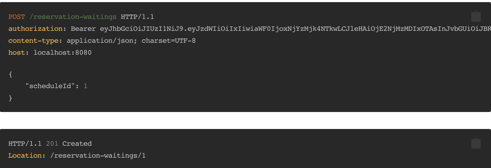
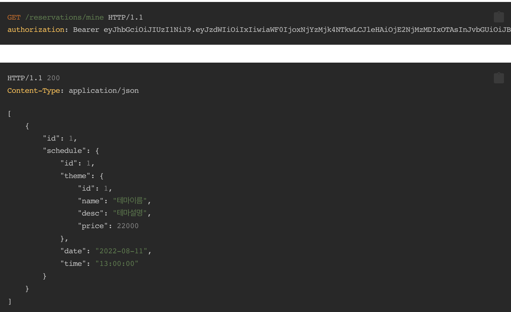
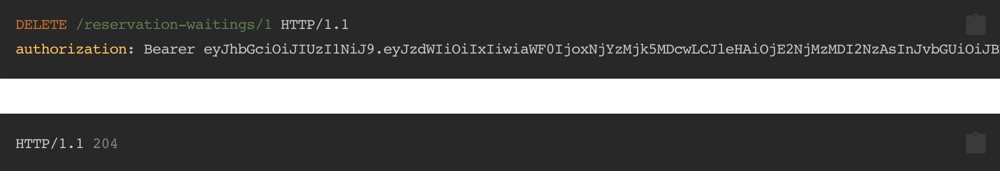
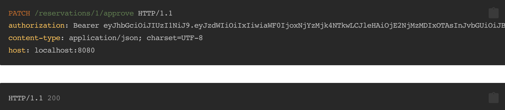
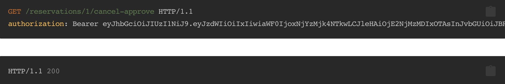

# spring room escape waiting

## 기능 요구사항

**예약 대기 신청**
* 이미 예약이 된 스케줄 대상으로 예약 대기를 신청할 수 있다.
* 예약이 없는 스케줄에 대해서 예약 대기 신청을 할 경우 예약이 된다.

**예약 대기 취소**
* 자신의 예약 대기를 취소할 수 있다.
* 자신의 예약 대기가 아닌 경우 취소할 수 없다.
* 없는 예약의 경우 취소할 수 없다.

**나의 예약 조회**
* 나의 예약 목록을 조회할 수 있다.
  * 예약과 예약 대기를 나눠서 조회한다.
  * 예약은 reservation을 조회하고 예약 대기는 reservation-waiting을 조회한다.
  * 예약 대기의 경우 대기 순번도 함께 조회할 수 있다.

**예약 승인(관리자)**
* 예약 승인 기능 구현
  * 사용자가 예약을 신청 후 관리자는 예약금 입금 확인을 하고 예약 승인을 한다
  * 예약 승인 시 예약의 상태는 예약 승인으로 변경된다.
  * 예약금이 매출로 기록된다.

**예약 취소**
* 사용자의 예약 취소 기능 구현
  * 사용자가 예약을 취소하는 경우
  * 예약이 예약 미승인 상태인 경우 예약이 자동으로 취소되어 예약 취소가 된다.
  * 예약 미승인 상태에서 취소하는 경우 예약금을 입금하지 않았다고 가정하여 매출 기록의 변경은 없다.
  * 예약이 예약 승인 상태인 경우 관리자의 승인이 필요하여 예약 취소 대기가 된다.
* 관리자의 예약 거절 기능 구현
  * 관리자가 예약을 거절하는 경우
  * 예약이 예약 미승인 상태인 경우 예약이 취소되어 예약 거절이 된다.
  * 예약이 예약 승인 상태인 경우 예약이 취소되어 예약 거절이 된다. 이 때 예약금 환불이 발생하여 매출 기록의 변경이 있다.

**예약 취소 승인**
* 관리자의 예약 취소 승인 기능 구현
  * 사용자가 예약을 취소 한 후 관리자가 예약 취소를 승인하는 경우
  * 예약이 예약 취소 대기에서 예약 취소로 변경된다.
  * 매출에 예약금 환불 이력이 추가된다.

    
### TESTCASE

**Admin**

* 일반 멤버는 예약을 등록할 수 있다
* 일반 멤버는 자신의 예약을 조회할 수 있다
* 일반 멤버는 자신의 예약을 삭제할 수 있다
* 일반 멤버는 테마를 등록할 수 없다
* 일반 멤버는 테마를 조회할 수 있다
* 일반 멤버는 테마를 삭제할 수 없다
* 일반 멤버는 스케줄을 등록할 수 없다
* 일반 멤버는 스케줄을 조회할 수 있다
* 일반 멤버는 스케줄을 삭제할 수 없다
* Admin 유저는 일반 유저를 Admin으로 변경할 수 있다
* 일반 유저는 다른 일반 유저를 Admin으로 변경할 수 없다

**Token**

* 토큰을 생성할 수 있다
* 토큰을 이용하여 유저 정보를 가져올 수 있다.

**Member**

* 멤버를 생성할 수 있다
* 조회를 할 때 로그인이 되지 않았을 경우, 에러 발생
* 잘못된 토큰을 입력하는 경우, 에러 발생
* 동일한 멤버가 중복 등록되는 경우, 에러 발생

**Reservation**

* 허용되지 않은 사용자가 예약을 이용할 때, 에러가 발생한다]
* 스케줄이 있는 경우, 예약을 생성할 수 있다.
* 스케줄이 없는 경우, 예약을 생성하면 에러가 발생한다
* 중복 예약을 생성할 경우, 에러가 발생한다
* 예약을 조회할 수 있다
* 예약이 없을 때 예약 목록은 비어있다.
* 예약을 삭제할 수 있다
* 없는 예약을 삭제할 경우, 에러가 발생한다
* 다른 회원이 삭제하는 경우, 에러가 발생한다

**Reservation Waiting**

* 예약이 되지 않은 스케줄에 예약 대기 신청을 하면 예약이 된다
* 예약이 되어있는 스케줄에 예약 대기 신청을 할 수 있다
* 자신의 예약 대기를 취소할 수 있다
* 없는 예약 대기의 경우 취소할 수 없다
* 자신의 얘약 대기가 아닌 경우 취소할 수 없다
* 로그인을 하지 않은 상태로 예약 대기 조회를 할 수 없다
* 로그인을 하지 않은 상태로 예약 대기 신청을 할 수 없다
* 로그인을 하지 않은 상태로 예약 삭제를 할 수 없다
* waitNum은 1부터 제공하며 이후에는 최대값+1 값을 제공한다

**Reservation Approve**

* Admin 유저만 예약 미승인 상태의 예약을 예약 승인 상태로 변경할 수 있다
* 사용자가 예약을 취소할 때 예약이 미승인 상태면 예약 취소 상태가 된다
* 사용자가 예약을 취소할 때 예약이 승인 상태면 예약 취소 대기 상태가 된다
* 관리자가 예약을 거절할 때 예약이 미승인 상태면 예약 거절 상태가 된다
* 관리자가 예약을 거절할 때 예약이 승인 상태면 예약 거절 상태가 된다
* 예약 취소 대기 상태의 예약을 관리자가 취소승인 하는경우 예약 취소 상태가 된다

**Schedule**

* 허용되지 않은 사용자가 스케줄을 이용할 때, 에러가 발생한다
* 테마가 있는 경우 스케줄을 생성할 수 있음
* 테마가 없는 스케줄을 생성하는 경우, 에러 발생
* 중복 예약을 생성할 경우, 에러가 발생한다
* 스케줄을 조회할 수 있음
* 예약이 없는 경우 스케줄을 삭제할 수 있음
* 예약이 되어있는 스케줄을 삭제하는 경우, 에러 발생
* 없는 스케줄을 삭제할 경우, 에러 발생

**Theme**

* 허용되지 않은 사용자가 테마를 이용할 때, 에러가 발생한다
* 테마를 생성할 수 있다.
* 중복 테마를 생성할 경우, 에러가 발생한다
* 테마를 조회할 수 있음
* 스케줄이 없는 경우, 테마를 삭제할 수 있다
* 스케줄이 있는데 테마를 삭제하는 경우, 에러 발생
* 없는 테마를 삭제할 경우, 에러가 발생한다

